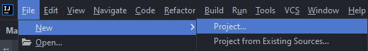

## Criação inicial do Spring Boot

1. Abra o intellij e clique em File > New > Project...

2. Depois coloque os dados necessários para o seu projeto

3. Defina quais dependencias seu projeto precisa e clique em **Finalizar**

4. Pronto! deixe o projeto carregar e ele ja vai configurar tudo sozinho.

## Criando um repositorio externo

1. Foi criado no Github um repositório para o nosso projeto:

2. Vamos transformar o nosso projeto em um projeto git usando o **Git init**

3. Vamos pegar o código do nosso repositório do Github e adicionar no nosso projeto com o **Git remote**

4. Para darmos um commit, devemos dizer o nome (github) do repositório externo
5. 